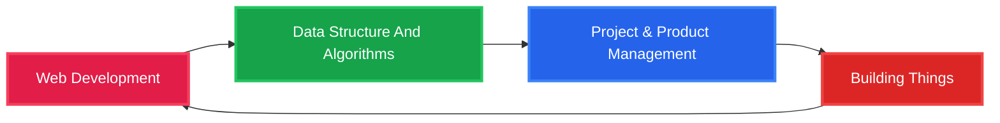

  
  

  

💻 CS Engineering | ☕ Tech talk, coding, and creative projects

📚 Polishing skills in C & frontend | 📖 Helping others grasp concepts with ease

##  TECH STACK:

 

## LEETCODE STATS:

##  CURRENT FOCUS:

🔗 Let’s connect and build something amazing together!

## 🔗 CONNECT WITH ME:

  

  ###  heyo!👀 I can see you…

